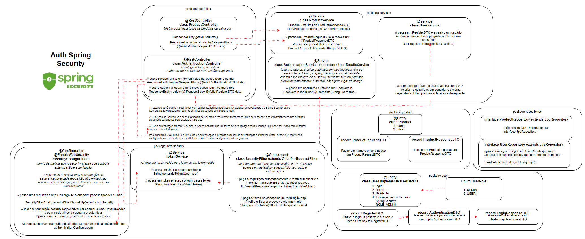
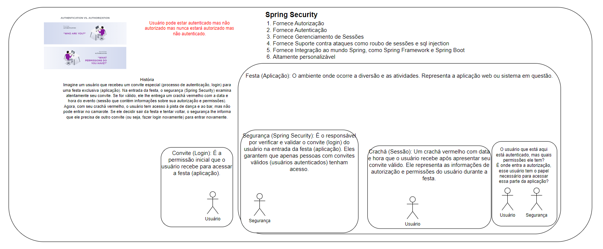
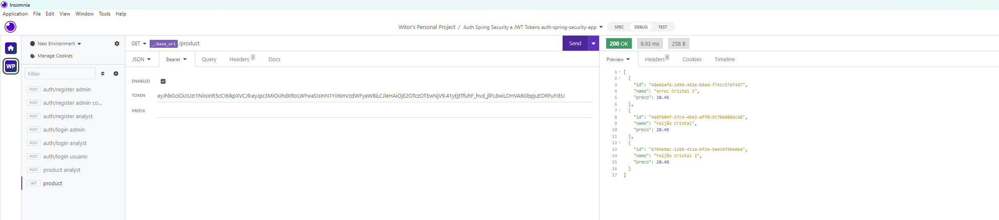
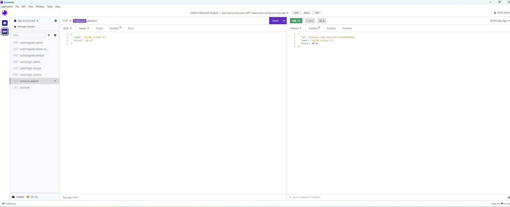
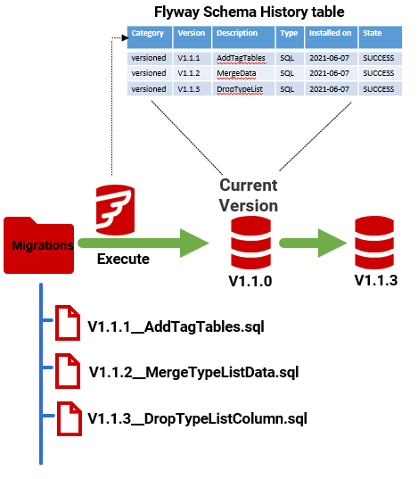
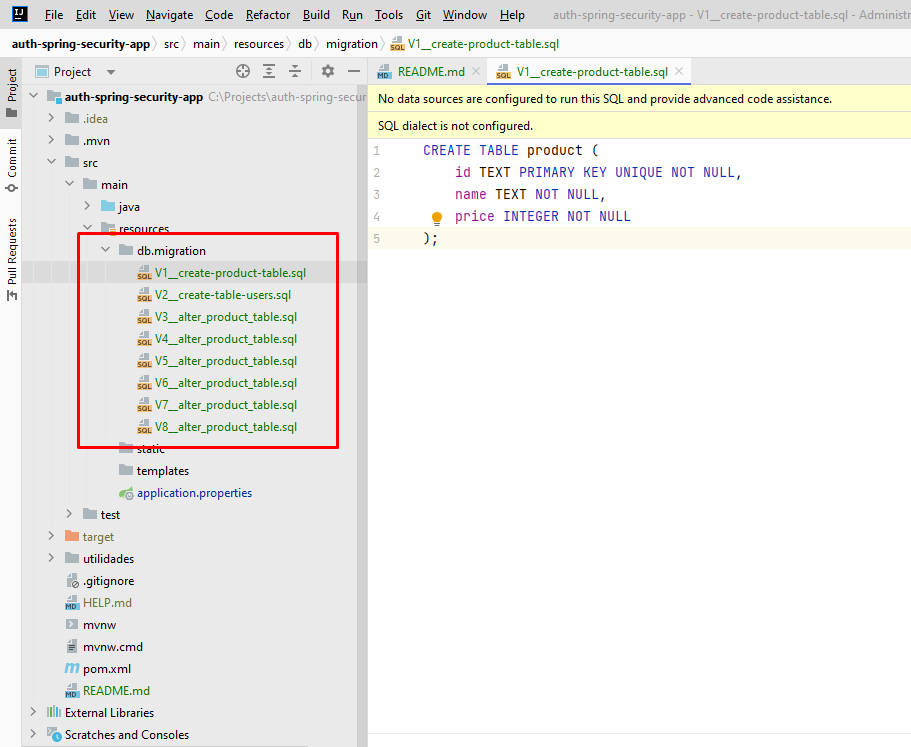

# API de Autenticação de Produtos com Spring Security


Este projeto é uma API construída utilizando **Java, Java Spring, Flyway Migrations, PostgresSQL como banco de dados e Spring Security e JWT para controle de autenticação.**


## Sumário

- [Visão Geral da Arquitetura](#visão-geral-da-arquitetura)
- [Instalação](#instalação)
- [Uso](#uso)
- [EndPoints da API](#endpoints-da-api)
- [Autenticação](#autenticação)
- [Banco de Dados](#banco-de-dados)

## Visão Geral da Arquitetura
 Aqui apresentamos um diagrama que esclarece a estrutura do projeto.


Vamos usar uma analogia para entender o Spring Security como uma festa.


## Instalação

1. Clone o repositório:

```bash
git clone https://github.com/witorsather/auth-spring-security-app.git
```

2. Instale as dependências com o Maven.

3. Instale o [PostgresSQL](https://www.postgresql.org/).

## Uso

1. Inicie a aplicação com o Maven.
2. A API estará acessível em http://localhost:8080.

## EndPoints da API
A API oferece os seguintes pontos de extremidade:

```markdown
GET /product - Recupere uma lista de todos os produtos. (todos os usuários autenticados)

POST /product - Registre um novo produto (acesso de ADMIN necessário).

POST /auth/login - Faça login no aplicativo.

POST /auth/register - Registre um novo usuário no aplicativo.
```

## Autenticação
A API utiliza o Spring Security para o controle de autenticação. Os seguintes papéis estão disponíveis:

```markdown
USUÁRIO 
ADMIN -> Papel de administrador para gerenciar parceiros (registro de novos parceiros).
ANALYST -> Papel de analista para publicar novos produtos (registro de novos produtos).
 ```
Para acessar os pontos de extremidade protegidos como um usuário ADMIN, forneça as credenciais de autenticação apropriadas no cabeçalho da solicitação com token tipo bearer.

### Insomnia
Anexado em /utilidades o arquivo insomnia usado.

#### USUÁRIO -> Papel padrão do usuário para usuários logados (obter a lista de produtos).


#### ANALYST -> Papel de analista para publicar novos produtos (registro de novos produtos).


## Banco de Dados
O projeto utiliza o [PostgresSQL](https://www.postgresql.org/) como banco de dados.

## Flyway
As migrações necessárias do banco de dados são gerenciadas usando o Flyway.





